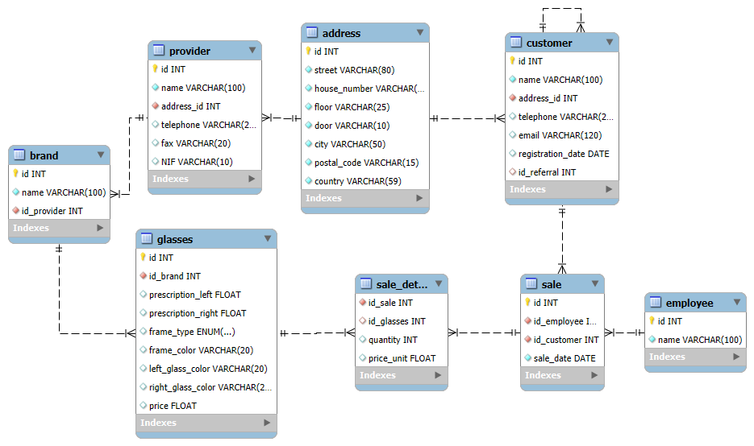

# 🕶️ Nivell 1 — Exercici 1: Òptica “Cul d’Ampolla”

## 📄 Enunciat
Una òptica, anomenada **“Cul d’Ampolla”**, vol informatitzar la gestió dels **clients**, **proveïdors**, **ulleres** i **vendes**.

L’objectiu és dissenyar una **base de dades relacional** que permeti registrar de manera eficient la informació dels proveïdors, les marques, les ulleres venudes i les dades de clients i empleats.

---

## 🧾 Requisits del sistema

### 🏢 Adreces
- Carrer  
- Número  
- Pis  
- Porta  
- Ciutat  
- Codi postal  
- País  

> 🔸 Les adreces s’han centralitzat en una taula pròpia (`address`), reutilitzada per a **clients** i **proveïdors**.

---

### 🧾 Proveïdors
- Nom  
- Adreça (`address_id`)  
- Telèfon  
- Fax  
- NIF  

> Cada proveïdor pot vendre ulleres de diverses **marques**.

---

### 🕶️ Ulleres
- Marca (`id_brand`)  
- Graduació de cada vidre (`prescription_left`, `prescription_right`)  
- Tipus de muntura (`Rimless`, `Plastic`, `Metal`)  
- Color de la muntura  
- Color de cada vidre  
- Preu  

> Les ulleres d’una marca provenen d’un únic proveïdor.  
> Cada marca pot tenir moltes ulleres.

---

### 👥 Clients
- Nom  
- Adreça (`address_id`)  
- Telèfon  
- Correu electrònic  
- Data de registre  
- Client recomanador (`id_referral`, opcional)

> 🔸 La relació **autoreferencial** permet identificar quin client ha recomanat un altre.  
> 🔸 Un client pot recomanar-ne molts, però només pot ser recomanat per un.

---

### 💼 Empleats
- Nom  

> Cada venda està associada a un empleat/da concret.

---

### 💸 Vendes
- Client (`id_customer`)  
- Empleat/da (`id_employee`)  
- Data de la venda  

> Les vendes s’emmagatzemen amb la seva data i els detalls dels productes venuts.

---

### 📦 Detall de vendes
- Venda (`id_sale`)  
- Ulleres (`id_glasses`)  
- Quantitat  
- Preu unitari  

> Cada venda pot incloure múltiples ulleres.  
> Si unes ulleres s’eliminen del catàleg, el registre de la venda es conserva amb el valor `NULL` a la columna corresponent.

---

## 🧱 Estructura de la base de dades

El disseny segueix una estructura **relacional normalitzada**, amb les següents taules principals:

| Taula | Descripció |
|--------|-------------|
| `address` | Adreces físiques de clients i proveïdors |
| `provider` | Informació dels proveïdors |
| `brand` | Cada marca està associada a un proveïdor |
| `glasses` | Ulleres associades a una marca |
| `customer` | Clients amb autoreferència per recomanació |
| `employee` | Empleats de l’òptica |
| `sale` | Registre de vendes (client, empleat, data) |
| `sale_detail` | Ulleres incloses en cada venda |

---

## 🔗 Relacions entre taules

- **address → provider / customer** → 1:N  
- **provider → brand** → 1:N  
- **brand → glasses** → 1:N  
- **customer → customer** → autoreferència (`id_referral`)  
- **customer → sale** → 1:N  
- **employee → sale** → 1:N  
- **sale → sale_detail → glasses** → N:M 

---

## 🧩 Diagrama relacional



---

## 🧰 Eines utilitzades

- 🐳 **Docker Desktop** — Contenidor MySQL 8.0  
- 💾 **MySQL Workbench 8.0** — Disseny de taules i execució de consultes  
- 🧩 **EER Diagram** — Exportat des de Workbench en format `.png`  

---

## ⚙️ Configuració del contenidor MySQL

Fitxer `docker-compose.yml` utilitzat:

```yaml
version: '3.9'

services:
  mysql:
    image: mysql:8.0
    container_name: my-mysql
    restart: always
    environment:
      MYSQL_ROOT_PASSWORD: admin123
      MYSQL_DATABASE: culdampolla_optics
      MYSQL_USER: esther
      MYSQL_PASSWORD: key123
    ports:
      - "3307:3306"
    volumes:
      - mysql_data:/var/lib/mysql

volumes:
  mysql_data:

